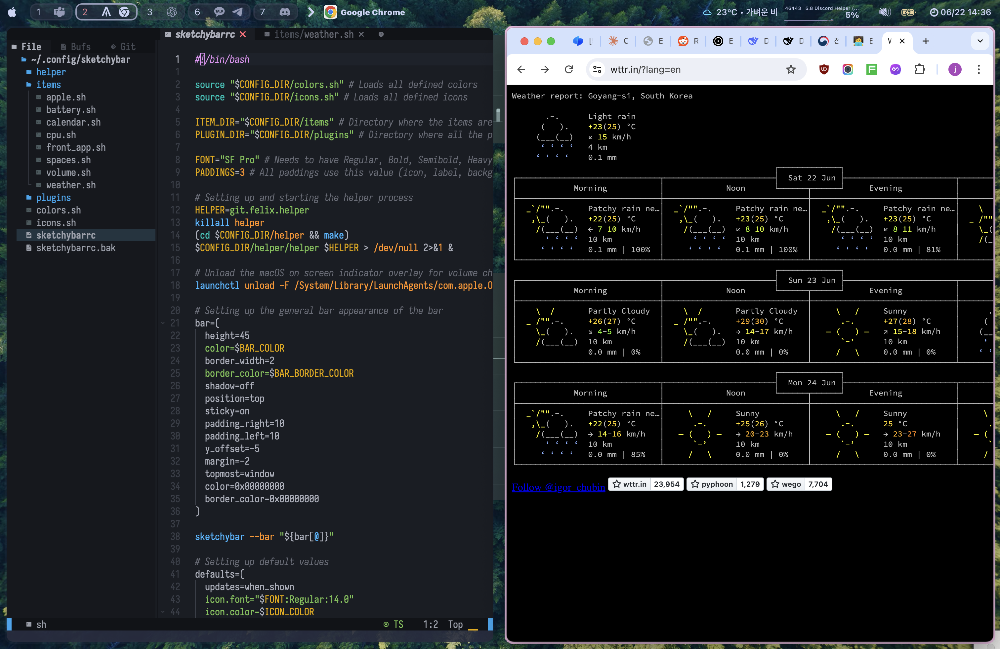

# sketkchybar-with-aerospace

linux에서 i3wm 을 사용합니다.
맥을 사용할 기회가 있어서 알아보던 준에 sketchybar 라는 bar가 있다는 것을 알게 되었습니다.
그리고, wiondow manager 으로는 yabai와 aerospace 등이 있는 것으로 알게 되었습니다.

저는 마우스를 지양하고, 키보드를 주로 사용하는 개발환경을 좋아해서 설정을 해 보게 되었습니다.

**aerospace를 사용하게 된 이유**

yabai는 설치하게되면 사용자의 높은 권한을 요구합니다.
이때문에 잘 알려져있지는 않지만, aerospace를 사용했습니다.

---

I use i3wm on Linux. I had the opportunity to use a Mac, and while exploring, I discovered a bar called SketchyBar. I also learned that there are window managers like Yabai and Aerospaced.

I prefer a development environment that minimizes mouse use and mainly utilizes the keyboard, so I decided to set it up accordingly.

**Why I Chose Aerospace**

Yabai requires elevated user privileges when installed. Due to this, I opted for Aerospaced, which is not as well-known.

# install configure

소스를 다운받은 다음에 `~/.config/` 폴더에 파일을 각각 복사합니다.

Next, after downloading the source, copy each file into the ~/.config/ folder.

## FONT

```bash
brew install --cask font-sf-pro
```

## configure 

```bash
mv sketchybar ~/.config/sketchybar
mv aerospace ~/.config/aerospace
```


# install sketchybar + aerospace

## 1. [sketchybar](https://github.com/FelixKratz/SketchyBar)

with homebrew

 ```bash
brew tap FelixKratz/formulaebrew install sketchybar
brew install sketchbar
```

### Hiding the original macOS bar

To ensure the bar is clearly visible, you need to hide the default top menu.

- (Pre macOS Ventura) Hide the default macOS menu bar in _System Preferences_ -> _Dock & Menu Bar_: 
- (macOS Ventura) Hide the default macOS menu bar in _System Settings_ -> _Desktop & Dock_ -> _Automatically hide and show the menu bar_ -> _Always_:  - (macOS Sonoma) Hide the default macOS menu bar in _System Settings_ -> _Control Center_ -> _Automatically hide and show the menu bar_ -> _Always_:  


## 2. [aerospace](https://nikitabobko.github.io/AeroSpace/guide)

```bash
brew install --cask nikitabobko/tap/aerospace
```

## 3. Optional

### 3.1. Aerosapce: Disable open animation

https://nikitabobko.github.io/AeroSpace/goodness#disable-open-animations

```bash
defaults write -g NSAutomaticWindowAnimationsEnabled -bool false
```

### 3.2. Aerosapce: 활성창 border 두껍게

관련 설정은 저장되어 있으며, 설치만 하면 된다.
The related configurations are already saved, so you just need to install it.

```bash
brew tap FelixKratz/formulae
brew install borderszz
```


